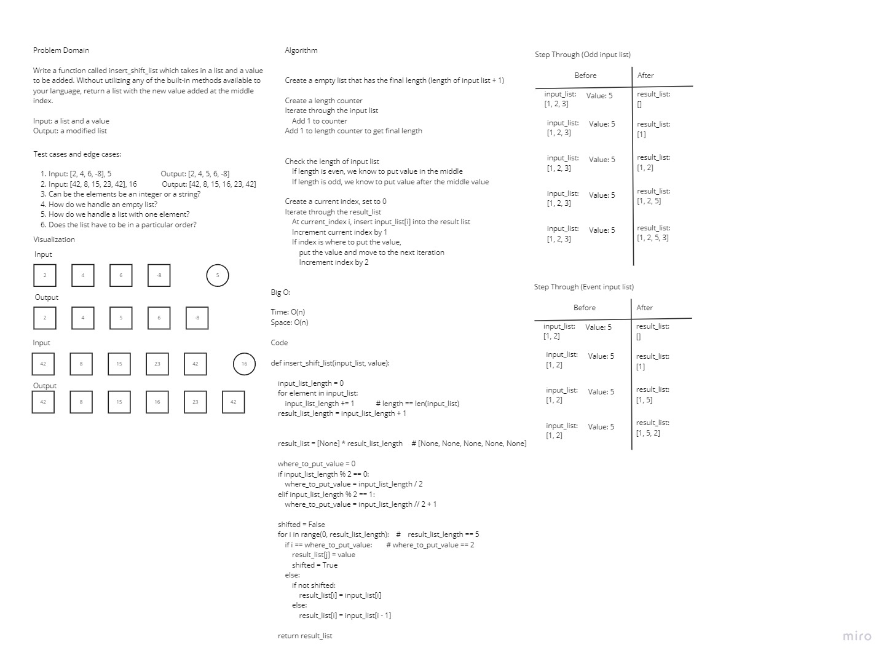

# Insert and Shift an Array in Middle at Index

Write a function called `insert_shift_list` which takes in a list and a value to be added. Without utilizing any of the built-in methods available to your language, return a list with the new value added at the middle index.

## Whiteboard Process

## Approach & Efficiency

First, we discussed the problem domain and talked about the input and output of the challenge. Then, we discussed some test case, edge cases and some clarifying questions. Then, we started to discuss what the algorithm to solve the problem might look like before writing out the code. After writing out the code, we discussed whether the code would perform as we expected and made some changes upon realizing some aspects that weren't considered before.

Our approach took O(N) space and O(N) time.
