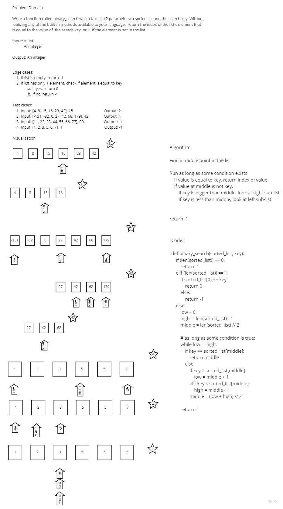

# Binary Search in a Sorted 1D Array

Write a function called `binary_search` which takes in 2 parameters: a sorted list and the search key. Without utilizing any of the built-in methods available to your language, return the index of the list's element that is equal to the value of the search key, or -1 if the element is not in the list.

## Whiteboard Process

## Approach & Efficiency

First, I looked into the linked Wikipedia article and the embedded diagram showing how binary search worked; I then discussed the problem domain and talked about the input and output of the challenge. Then, I noted down some possible edge cases. Next, I wrote down some test cases. After that, I created some visualizations for three of the test cases I wrote down and walked through how this algorithm is supposed to work. Then, I wrote down the basic idea of the algorithm. Finally, I wrote the code to the algorithm, but I did not have enough time to go over the time and space complexity of the algorithm.

This algorithm takes O(log N) time and O(1) space.
