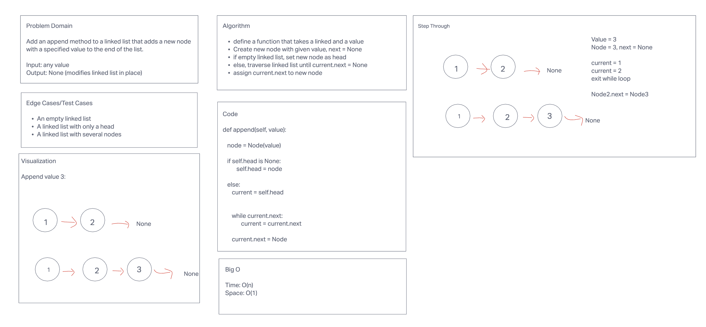
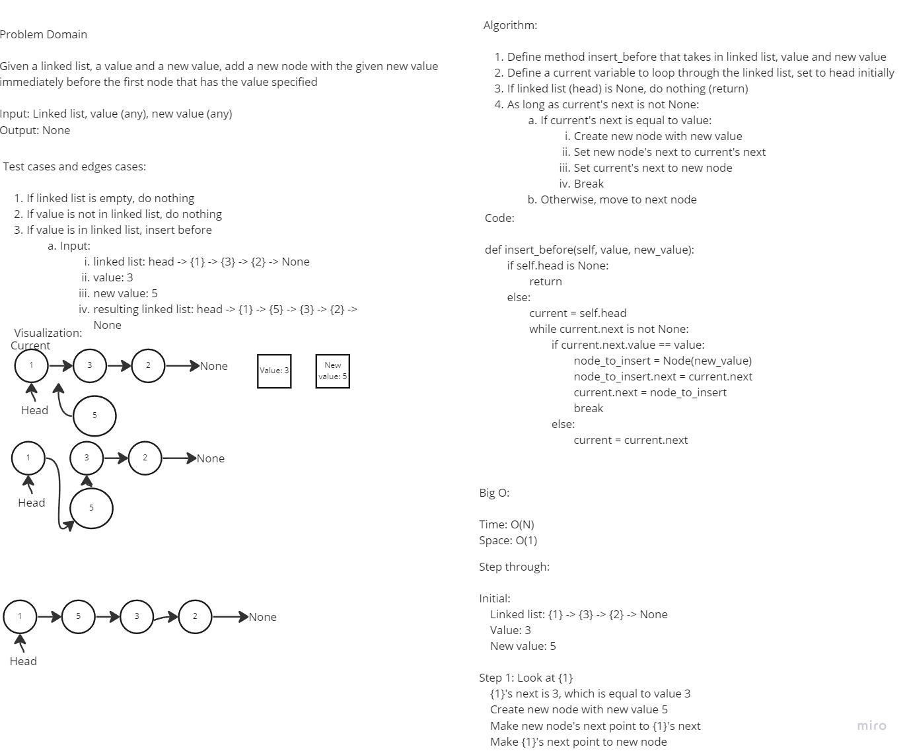
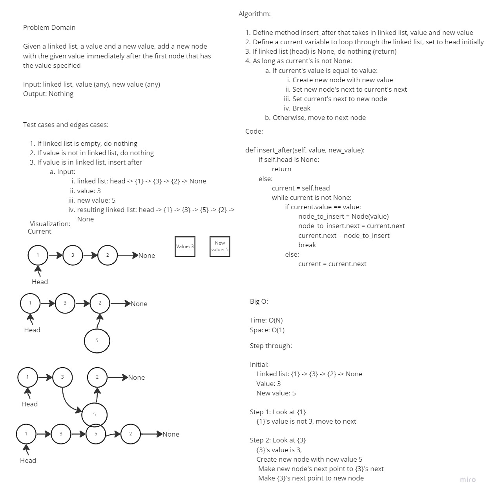

# Challenge Summary

Implement the following methods for the Linked List class:

- `append`:
  - Arguments: `new value`
  - Adds a new node with the given `new value` to the end of the list
- `insert_before`:
  - Arguments: `value`, `new value`
  - Adds a new node with the given `new value` immediately before the first node that has the `value` specified
- `insert_after`:
  - Arguments: `value`, `new value`
  - Adds a new node with the given `new value` immediately after the first node that has the `value` specified

## Whiteboard Process

The whiteboard process was done with Monika Davies







## Approach & Efficiency

We implemented the methods using the whiteboard process first. Then, I copied the code from the whiteboard process into the repository and run the tests against the code making small changes as necessary to make the tests pass. I also made some changes to the code that was copied to improve readability.

- `append`:
  - Time: O(N)
  - Space: O(1)
- `insert_before`:
  - Time: O(N)
  - Space: O(1)
- `insert_after`:
  - Time: O(N)
  - Space: O(1)

## Solution

To run the tests for this code challenge, make sure you `cd` into the `python` directory first.

Then create a virtual environment:

```bash
python3 -m venv .venv
```

Then activate the virtual environment:

```bash
source .venv/bin/activate
```

Then install the dependencies:

```bash
pip install -r requirements.txt
```

To run the tests for this code challenge:

```bash
pytest -v tests/code_challenges/test_linked_list_insertions.py
```

To deactivate the virtual environment:

```bash
deactivate
```

### Link to Code

[Link to Code](../../data_structures/linked_list/linked_list.py)
