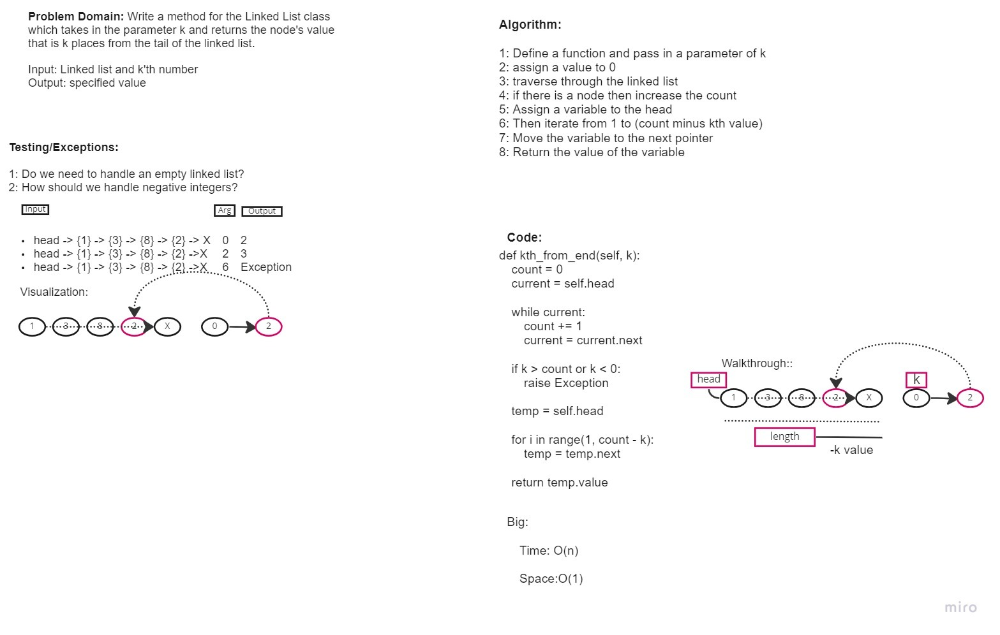

# Challenge Summary

Write a function `kth_from_end` which takes a linked list and a number `k` as an argument and returns the node's value that is `k` places from the tail of the linked list.

## Whiteboard Process

The whiteboard process was done with Daniel Brott and Natalija Germek.




## Approach & Efficiency
<!-- What approach did you take? Why? What is the Big O space/time for this approach? -->

## Solution

To run the tests for this code challenge, make sure you `cd` into the `python` directory first.

Then create a virtual environment:

```bash
python3 -m venv .venv
```

Then activate the virtual environment:

```bash
source .venv/bin/activate
```

Then install the dependencies:

```bash
pip install -r requirements.txt
```

To run the tests for this code challenge:

```bash
pytest -v tests/code_challenges/test_linked_list_kth.py
```

To deactivate the virtual environment:

```bash
deactivate
```
