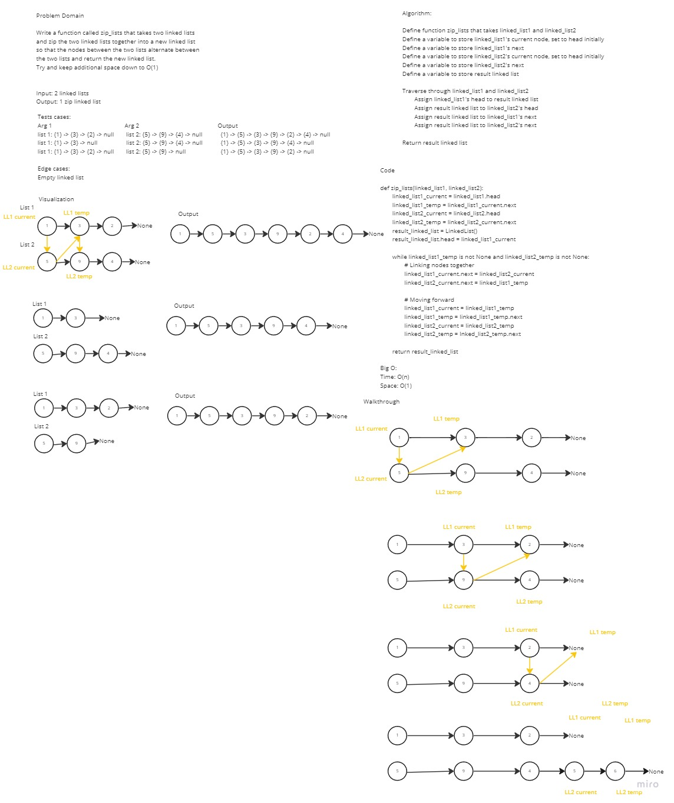

# Challenge Summary

Write a function `zip_lists` that takes two linked lists and zip the two linked lists together into a new linked list so that the nodes between the two lists alternate between the two lists and return the new linked list.

## Whiteboard Process

The whiteboard process was done with Daniel Brott and Natalija Germek.



## Approach & Efficiency

We whiteboarded a rough idea of what the algorithm would look like and then used visualizations to guide us toward a concrete implementation. Through the visualizations, we were able to distinguish the zipping of the nodes versus the moving of our pointers to the next nodes.

Time Complexity: O(N)

Space Complexity: O(1)

## Solution

To run the tests for this code challenge, make sure you `cd` into the `python` directory first.

Then create a virtual environment:

```bash
python3 -m venv .venv
```

Then activate the virtual environment:

```bash
source .venv/bin/activate
```

Then install the dependencies:

```bash
pip install -r requirements.txt
```

To run the tests for this code challenge:

```bash
pytest -v tests/code_challenges/test_linked_list_zip.py
```

To deactivate the virtual environment:

```bash
deactivate
```

### Link to Code

[Link to Code](../linked_list_zip.py)
