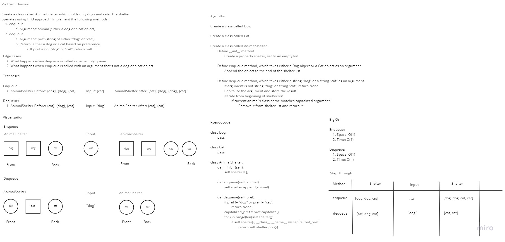

# Challenge Summary

- Create a class called AnimalShelter which holds only dogs and cats.
- The shelter operates using a first-in, first-out approach.
- Implement the following methods:
  - enqueue
    - Arguments: animal
      - animal can be either a dog or a cat object.
  - dequeue
    - Arguments: pref
      - pref can be either "dog" or "cat"
    - Return: either a dog or a cat, based on preference.
      - If pref is not "dog" or "cat" then return null.

## Whiteboard Process



## Approach & Efficiency

I whiteboarded the problem domain, test cases and edge cases and outlined a basic pseudocode and solution to the problem domain, but I misunderstood the code challenge at the beginning and whiteboarded a solution using a list that behaves like a queue

Complexity:

- `enqueue`:
  - Time: O(N)
  - Space: O(1)
- `dequeue`:
  - Time: O(N)
  - Space: O(1)

## Solution

To run the tests for this code challenge, make sure you `cd` into the `python` directory first.

Then create a virtual environment:

```bash
python3 -m venv .venv
```

Then activate the virtual environment:

```bash
source .venv/bin/activate
```

Then install the dependencies:

```bash
pip install -r requirements.txt
```

To run the tests for this code challenge:

```bash
pytest -v tests/code_challenges/test_stack_queue_animal_shelter.py
```

To deactivate the virtual environment:

```bash
deactivate
```

## Link to Code

[Link to Code](../../code_challenges/stack_queue_animal_shelter.py)
