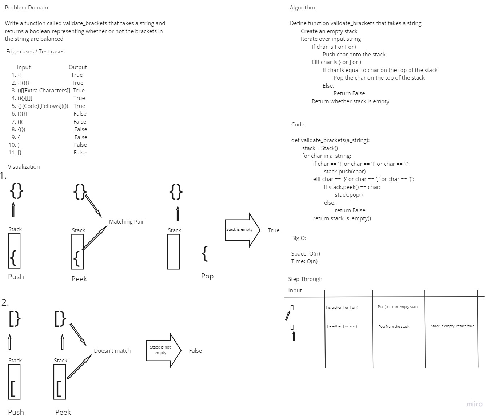

# Challenge Summary

- Write a function called validate brackets
  - Arguments: string
  - Return: boolean
    - representing whether or not the brackets in the string are balanced

## Whiteboard Process



## Approach & Efficiency

I whiteboarded the problem domain, test cases and edge cases and outlined a basic pseudocode and solution to the problem domain.

Complexity:

Time: O(N)
Space: O(N)

## Solution

To run the tests for this code challenge, make sure you `cd` into the `python` directory first.

Then create a virtual environment:

```bash
python3 -m venv .venv
```

Then activate the virtual environment:

```bash
source .venv/bin/activate
```

Then install the dependencies:

```bash
pip install -r requirements.txt
```

To run the tests for this code challenge:

```bash
pytest -v tests/code_challenges/test_stack_queue_brackets.py
```

To deactivate the virtual environment:

```bash
deactivate
```

## Link to Code

[Link to Code](../../code_challenges/stack_queue_brackets.py)
