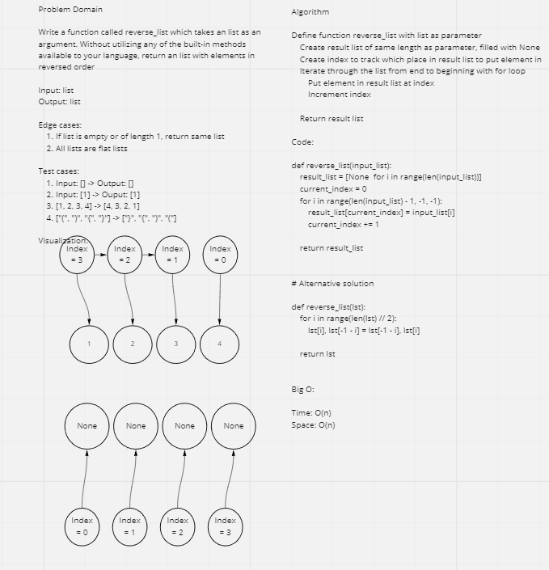

# Reverse an Array

Write a function called `reverse_list` which takes a list as an argument. Without utilizing any of the built-in methods available to your language, return a list with elements in reversed order.

## Whiteboard Process

## Approach & Efficiency

First, I talked about the input and output of the challenge. Then, I discussed the edge cases. Listing out input, output and edge cases helped me understand the exact problem I was tasked to solve. Then, I listed out some test cases and visualized a test case to show the interviewer my thought process. Next, I wrote the pseudocode and the code to my solution.

My approach took O(N) space and O(N) time.
