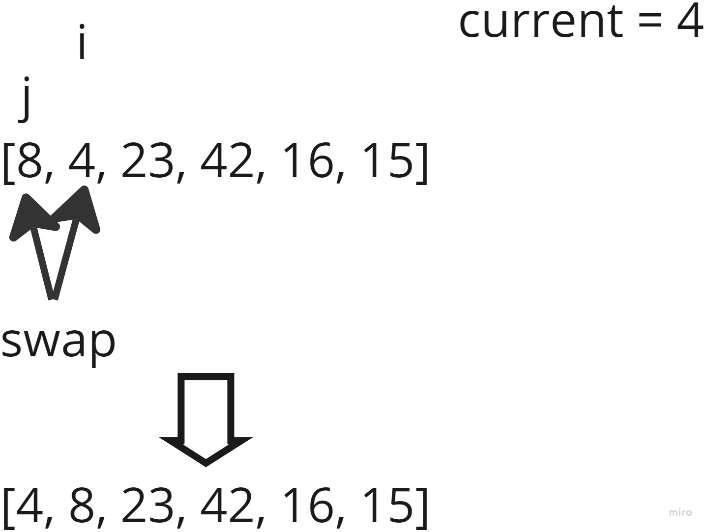
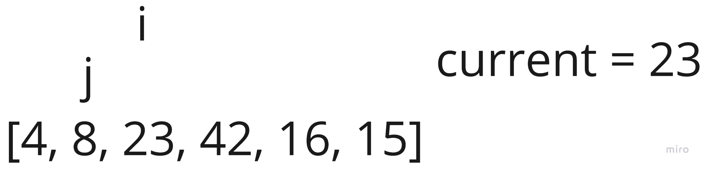
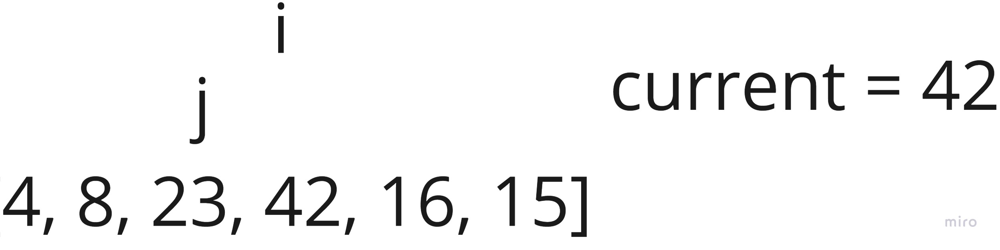
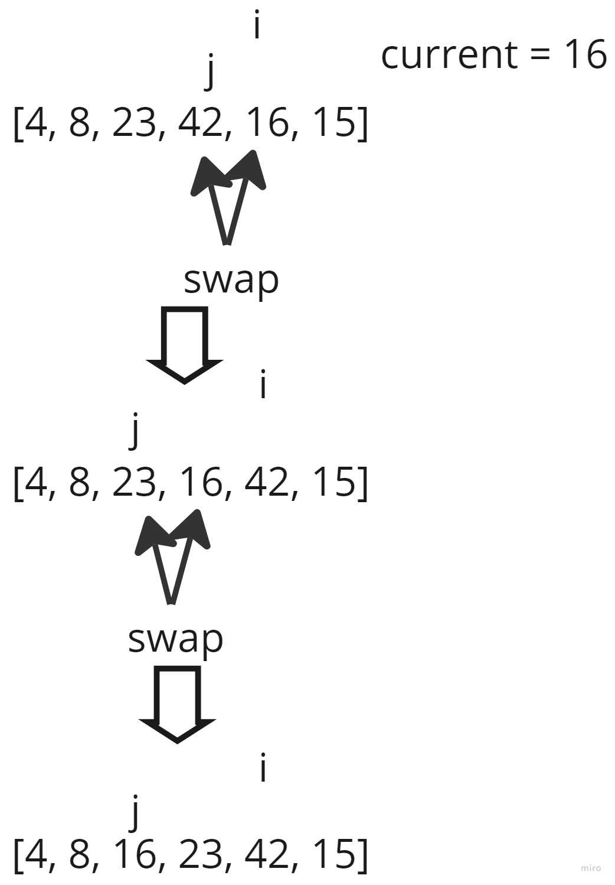
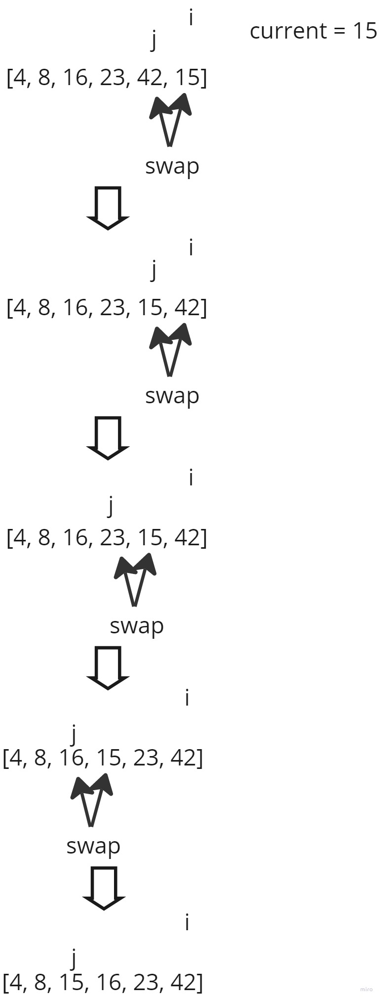

# Blog Notes: Insertion Sort

Insertion sort is a sorting algorithm that works by assuming that all elements to the left of the current element are sorted. Next, we iterate over the array from the first element until the end of the array. If the current element is out of place, all elements to the left of the current element that are bigger than the current element are swapped rightward one by one until they are to the right of the current element. At that point, the current element is in the correct spot.

## Pseudocode

```md
InsertionSort(int[] arr)
    FOR i = 1 to arr.length
        int j = i - 1
        int current = arr[i]

        WHILE j >= 0 AND current < arr[j]
            arr[j + 1] = arr[j]
            j = j - 1

        arr[j + 1] = current
```

## Visualization

Sample array: [8, 4, 23, 42, 16, 15]

1st loop:



We consider everything to the right of the current element, which is 4, to be sorted. Since 4 is smaller than 8, 8 gets swapped with 4.

2nd loop:



The current element is 23, and everything left of 23 is already sorted so nothing happens.

3rd loop:



The current element is 42, and everything left of 42 is already sorted so nothing happens.

4th loop:



The current element is 16, and the element to the left of 16, which is 42, is bigger so 42 gets swapped with 16.

Then, 16 is bigger than 23 so 23 gets swapped with 16.

5th loop:



The current element is 15, and the element to its left is 42 and it is bigger so 42 gets swapped with 15.

Then, 23 is bigger than 15 so 23 is swapped with 15.

Then, 16 is bigger than 15 so 16 is swapped with 15.

## Efficiency

Time: O(n^2)

- In the worst scenario, the array is sorted in reverse and the swapping will need to invert this reversed sort.

Space: O(1)

- No additional space is needed.

## Solution

To run the tests for this code challenge, make sure you cd into the `sorting` directory first.

```bash
python3 -m venv .venv
```

Then activate the virtual environment:

```bash
source .venv/bin/activate
```

Then install the dependencies:

```bash
pip install -r requirements.txt
```

To run the tests for this code challenge:

```bash
pytest -v tests/test_insertion_sort.py
```

To deactivate the virtual environment:

```bash
deactivate
```

## Link to Code

[Link to Code](insertion_sort.py)
